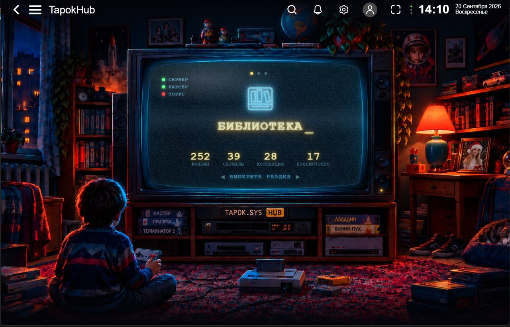
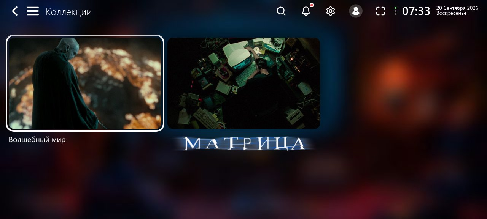
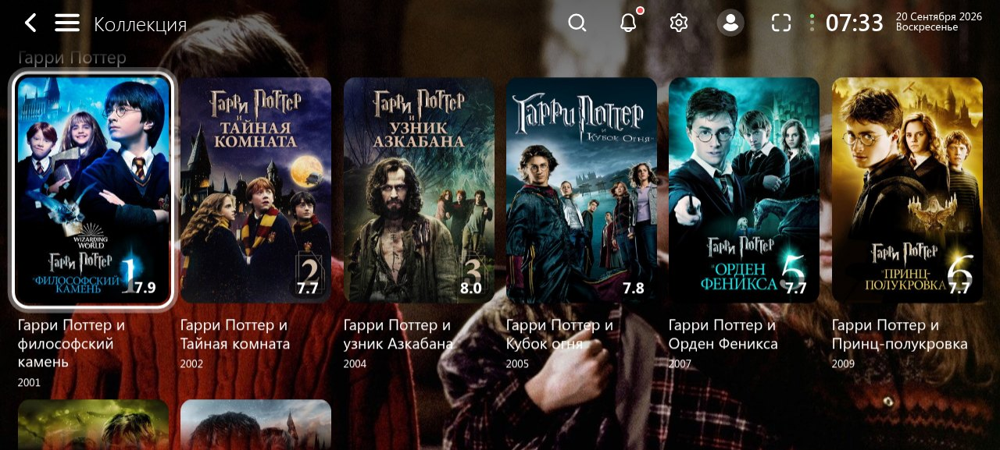
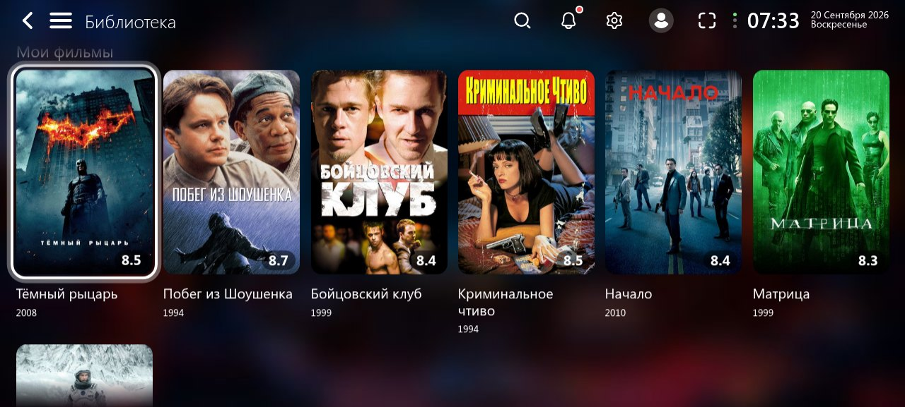
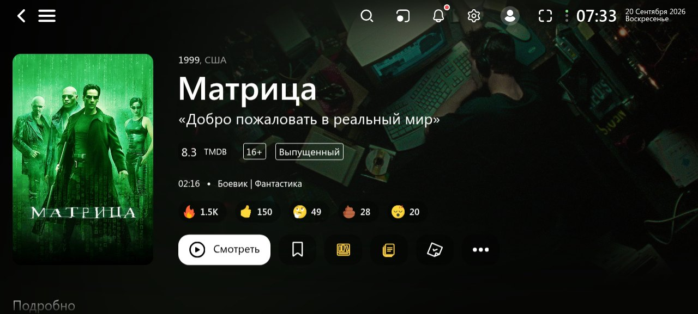
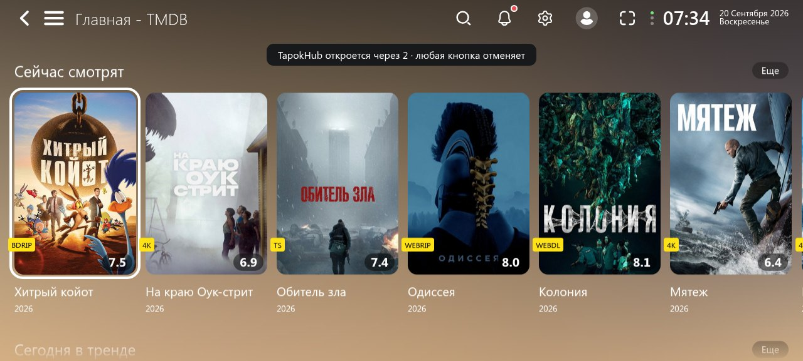
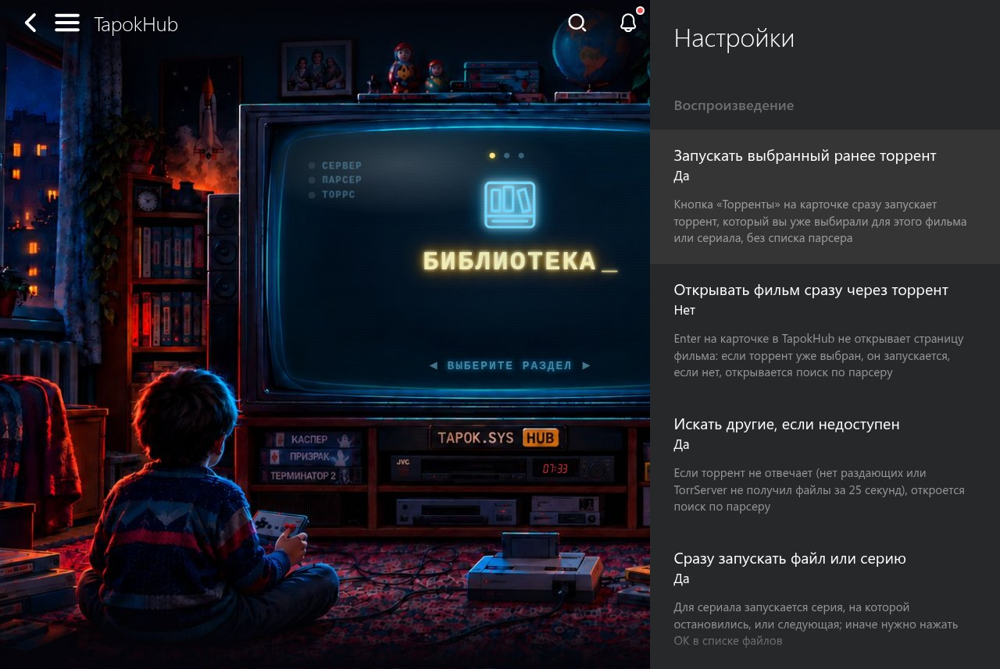
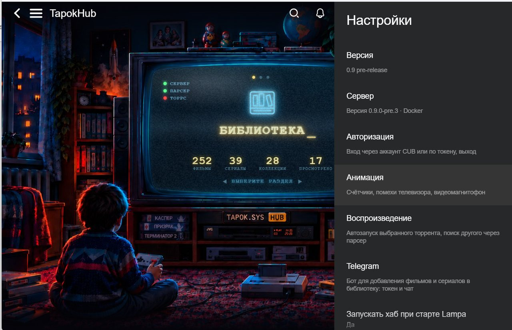
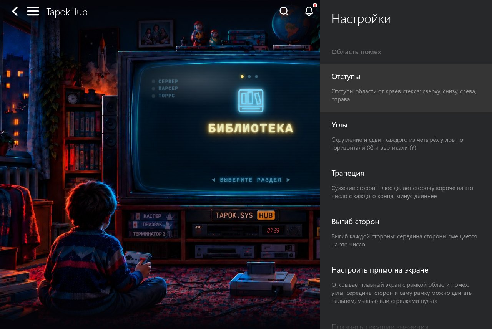

# TapokHub

🇷🇺 Русский · 🇬🇧 [English](README.en.md)

**Плагин для [Lampa](https://github.com/yumata/lampa-source) с собственным сервером: коллекции франшиз, личная библиотека, рекомендации и запуск нужной раздачи одной кнопкой. Главный экран оформлен как ретро-комната с телевизором.**



> **Статус: 0.9 pre-release.** Проект работает и используется, но до версии 1.0 возможны изменения и шероховатости.
> Об ошибках пишите в [Issues](../../issues).

Интерфейс плагина выбирается по языку Lampa: русский, украинский и белорусский дают русский интерфейс, остальные языки английский. Сообщения сервера, Telegram-бот и скрипты установки подстраиваются под язык запроса, отправителя или системы (см. [Язык](docs/INSTALL.md#язык)).

## Попробовать без установки

Есть открытый демо-сервер: **https://test.typokhub.ru**. Подключите плагин в Lampa (Настройки → Расширения → Добавить плагин):

```
https://test.typokhub.ru/tapokhub.js
```

Затем Настройки → TapokHub → Авторизация → «Войти через аккаунт CUB». Регистрация на демо открыта, нужен только аккаунт CUB, в который вошла Lampa.

В демо у каждого пользователя есть пределы: **30 фильмов, 5 сериалов и 5 коллекций франшиз**. Это учебный сервер: данные на нём могут сбрасываться, не храните там ничего важного. Свой сервер без ограничений ставится по [руководству](docs/GUIDE.md).

## Что умеет

### Коллекции франшиз

Нажимаете «Создать коллекцию» на карточке фильма, и сервер собирает всю франшизу целиком: части, спин-оффы, сериалы и
мультсериалы (данные TMDB и Wikidata). Лишнее можно скрыть, недостающее добавить вручную, коллекцию пересобрать или удалить.

<p>
  
  
</p>

### Личная библиотека и рекомендации

Кнопка «В библиотеку» на карточке собирает отдельные фильмы и сериалы в один раздел, разбитый по группам: фильмы,
сериалы, мультфильмы, аниме, документальное. Рекомендации строятся по тому, что вы уже посмотрели.

<p>
  
  
</p>

### Запуск выбранного торрента

Если раздачу для фильма или сериала вы уже выбирали, кнопка «Торренты» сразу запускает её через TorrServer (для сериала
следующую серию). Раздача не отвечает: открывается обычный поиск по парсеру. Хаб можно настроить на автозапуск с отсчётом:
любое действие его отменяет.

<p>
  
  
</p>

### Новинки

Сервер раз в сутки перепроверяет ваши франшизы. Новая часть или сезон получает метку **NEW** на 14 дней и уведомление в
колокольчике Lampa. Уведомления можно получать и в **Telegram**: бот привязывается к вашему аккаунту командой `/start`.

### Ретро-хаб и настройки

Телевизор, меню разделов в «стекле», индикаторы связи (сервер, парсер, TorrServer) и необязательные эффекты: помехи ЭЛТ,
видеомагнитофон, счётчики. Всё настраивается в Настройки → TapokHub.

<p>
  
  
</p>

### Ещё

- **Работает там, где TMDB заблокирован.** Сервер кеширует ответы и картинки TMDB и отдаёт последнюю копию, даже если TMDB
  недоступен.
- **Данные общие на всех ваших устройствах.** Вход через аккаунт CUB, у каждого пользователя свои коллекции, библиотека,
  выбранные раздачи и настройки. Пароль в плагин вводить не нужно.
- **Регистрация** на сервере открывается и закрывается прямо в настройках плагина (это может владелец сервера).

## Что понадобится

- **Lampa версии 3.0.5 или новее** на телевизоре, телефоне или в браузере.
- **Свой сервер**: недорогой VPS, домашний компьютер, мини-ПК или NAS с Linux. TapokHub работает в **Docker**, установщик поставит его сам.
- Для запуска раздач: TorrServer и парсер, как обычно для Lampa (у самого TapokHub они необязательны).

## Быстрый старт

1. **Сервер.** Подключитесь к нему по SSH и выполните, подставив свой домен и почту:

   ```bash
   curl -fsSL https://tapoksys.github.io/TAPOKHUB-Lampa-addon/install.sh | sudo bash -s -- --domain tapok.example.com --email you@example.com
   ```

   Установщик поставит Docker, настроит HTTPS и запустит сервер. Без домена (по http, для домашней сети) уберите `--domain tapok.example.com`.
2. **Плагин.** В Lampa: Настройки → Расширения → Добавить плагин, адрес `https://ваш-домен/tapokhub.js`. Перезапустите Lampa. Либо **общий плагин** для любого сервера: `https://tapoksys.github.io/t.js`, затем Настройки → TapokHub → «Ввести адрес сервера вручную».
3. **Вход.** Настройки → TapokHub → Авторизация → «Войти через аккаунт CUB».

## Документация

| Документ | О чём |
|---|---|
| [Руководство](docs/GUIDE.md) | развёртывание, все функции по порядку с картинками, Telegram-бот, управление сервером, диагностика |
| [Установка](docs/INSTALL.md) | установщик, настройки, HTTPS, обновление, откат, копии, удаление |
| [Журнал изменений](CHANGELOG.md) | что нового в каждой версии |

## Что хранит сервер

- У каждого пользователя: его коллекции и их состав, библиотека, выбранные раздачи (название, magnet-ссылка, трекер),
  настройки плагина. Всё в файле базы на вашем сервере.
- Общий кеш: ответы TMDB и Wikidata, картинки.
- **Не хранится:** токен вашего аккаунта CUB (сервер только спрашивает у CUB, чья это почта), пароли, история просмотров.
