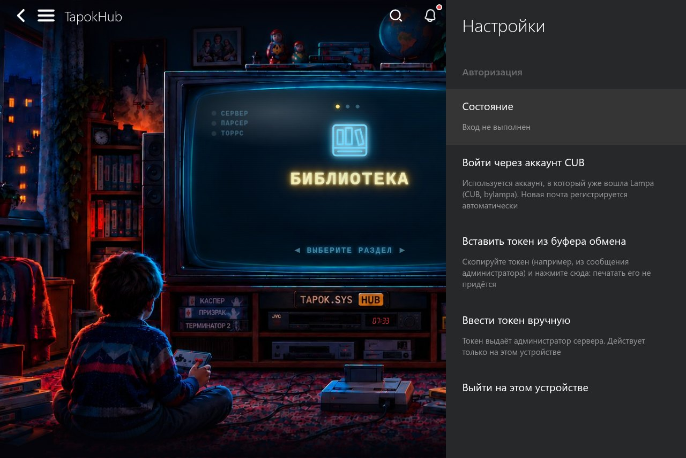
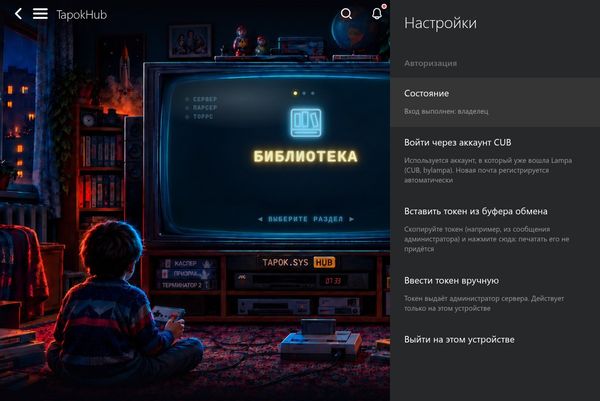
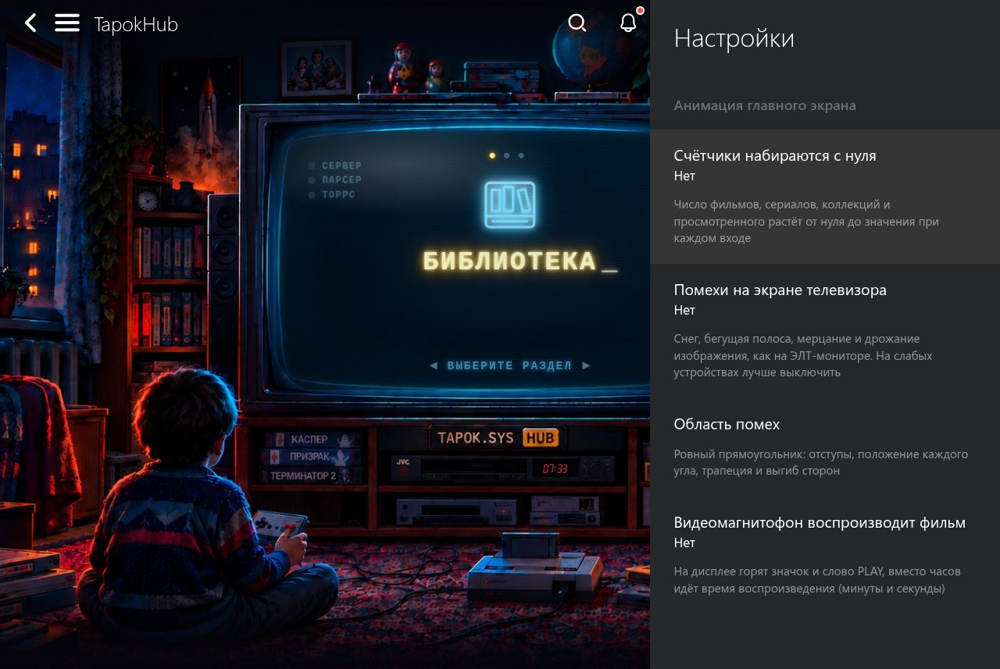
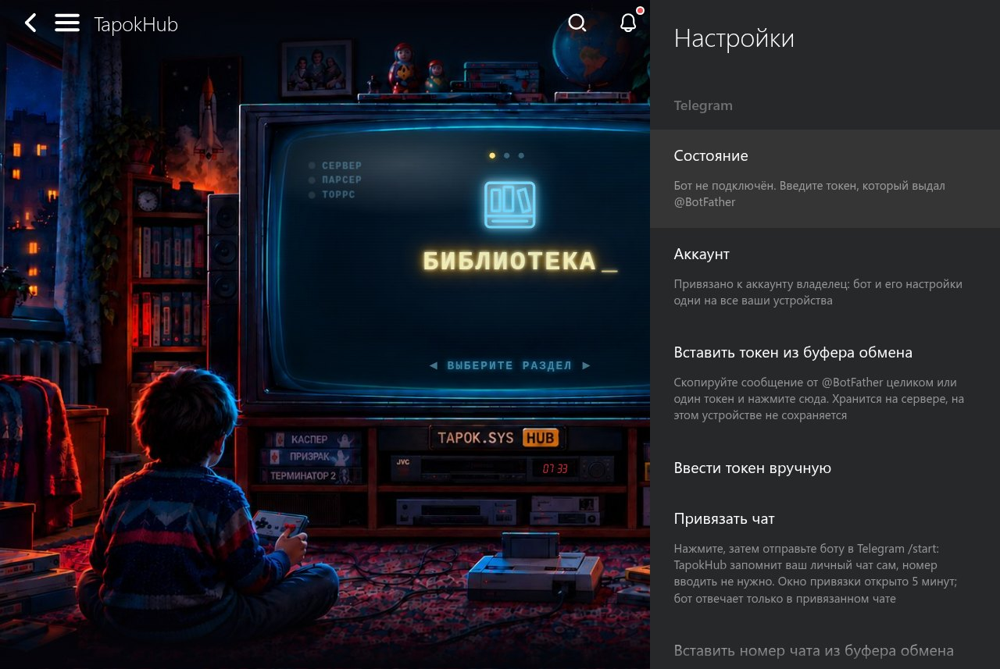

# TapokHub: руководство

🇷🇺 Русский · 🇬🇧 [English](en/GUIDE.md)

## Содержание

1. [Что это и как устроено](#1-что-это-и-как-устроено)
2. [Что понадобится](#2-что-понадобится)
3. [Развёртывание сервера](#3-развёртывание-сервера)
4. [Подключение плагина и вход](#4-подключение-плагина-и-вход)
5. [Работа: функции по порядку](#5-работа-функции-по-порядку)
6. [Настройки плагина](#6-настройки-плагина)
7. [Telegram-бот](#7-telegram-бот)
8. [Управление сервером](#8-управление-сервером)
9. [Обновление, копии, откат](#9-обновление-копии-откат)
10. [Безопасность и пределы](#10-безопасность-и-пределы)
11. [Диагностика](#11-диагностика)
12. [Справочник](#12-справочник)

---

## 1. Что это и как устроено

TapokHub состоит из двух частей.

- **Плагин для Lampa.** Работает на вашем устройстве (телевизор, телефон, браузер): главный экран-хаб, разделы «Библиотека», «Рекомендации», «Коллекции», кнопки на карточке фильма, настройки.
- **Сервер.** Работает у вас (VPS, домашний компьютер, мини-ПК, NAS). Хранит коллекции, библиотеку, выбранные раздачи и настройки, кеширует ответы и картинки TMDB, собирает франшизы по данным TMDB и Wikidata, запускает Telegram-бота.


Данные общие для всех устройств одного пользователя: вошли под той же почтой CUB на другом устройстве, и коллекции, библиотека, выбранные торренты и настройки уже там. Плагин не хранит на устройстве ничего, что нельзя восстановить с сервера.

Что сервер **не** хранит: токен вашего аккаунта CUB (сервер только спрашивает у CUB, чья это почта), пароли, историю просмотров (список «просмотрено» знает только Lampa).

## 2. Что понадобится

| Что | Подробности |
|---|---|
| Lampa | версия **3.0.5 или новее** (телевизор, телефон или браузер) |
| Сервер | любой компьютер с Linux: 1 ГБ памяти и 5 ГБ диска хватит для начала. TapokHub работает в Docker; установщик поставит его сам |
| Аккаунт CUB | вход в плагин идёт через аккаунт CUB (или его зеркала), в который уже вошла Lampa |
| Домен (по желанию) | нужен для HTTPS; без него сервер работает по http в домашней сети |
| TorrServer и парсер (по желанию) | нужны только для запуска раздач, как для обычной Lampa. |

**Про http и https.** Страница Lampa, открытая по `https://` (например, lampa.mx), загружает плагин только с `https://`. Приложение Lampa на телевизоре и телефоне работает и с `http://` в домашней сети. Сервер в интернете без HTTPS не держите: токены не шифруются.

## 3. Развёртывание сервера

TapokHub работает в Docker. Одна команда ставит Docker (если его нет), запускает сервер и печатает адрес плагина. Подробно (все параметры, HTTPS, обновление, копии): [Установка](INSTALL.md).

### А. С доменом и HTTPS

Домен (например `tapok.example.com`) уже указывает на IP сервера, порты 80 и 443 свободны.

```bash
curl -fsSL https://tapoksys.github.io/TAPOKHUB-Lampa-addon/install.sh | sudo bash -s -- --domain tapok.example.com --email you@example.com
```

Установщик ставит Docker, запускает сервер и Caddy, который сам получает сертификат Let's Encrypt, и печатает адрес плагина. Регистрация на новом сервере **закрыта**: войти могут вы (почта из `--email`) и те, кого вы добавите. Повторный запуск той же команды обновляет сервер, данные сохраняются.

### Б. Без домена (http)

```bash
curl -fsSL https://tapoksys.github.io/TAPOKHUB-Lampa-addon/install.sh | sudo bash -s -- --email you@example.com
```

Плагин будет по адресу `http://адрес-сервера:8080/tapokhub.js`; другой порт: `--port`. Только для домашней сети: трафик не шифруется.

### В. Вручную, через Docker Compose

```bash
mkdir -p /opt/tapokhub && cd /opt/tapokhub
curl -fsSLO https://raw.githubusercontent.com/TAPOKSYS/TAPOKHUB-Lampa-addon/main/compose.yaml
docker compose up -d
```

Откройте `http://адрес-компьютера:8080/`: страница покажет адрес плагина. Токен доступа создаётся при первом запуске: `docker compose exec tapokhub cat /data/token`. Настройки задаются переменными в файле `.env` рядом с `compose.yaml` (полная таблица в [справочнике](#12-справочник)):

```
TAPOK_ADMIN_EMAIL=you@example.com    # почта администратора: с ней входите через CUB
TAPOK_REGISTRATION=closed            # closed (по умолчанию) или open
TAPOK_PUBLIC_URL=https://tapok.example.com   # если сервер стоит за своим прокси или доменом
TAPOK_LANG=ru                        # язык сообщений сервера: ru или en
TAPOK_PORT=8080
```

### Г. За вашим nginx

Если nginx уже стоит на сервере и сам отдаёт сертификаты, контейнер слушает только этот компьютер, а nginx проксирует на него запросы. Настройки и пример конфигурации: [Установка → HTTPS](INSTALL.md#https).

## 4. Подключение плагина и вход

### 4.1. Добавить плагин

Есть два способа, выберите любой.

**Плагин вашего сервера.** Lampa → Настройки → Расширения → Добавить плагин → введите адрес `https://tapok.example.com/tapokhub.js` (сервер сам отдаёт плагин с вашим адресом внутри) → перезапустите Lampa.

**Общий плагин.** Один файл для всех серверов: `https://tapoksys.github.io/t.js`. Добавьте его так же (Настройки → Расширения → Добавить плагин), перезапустите Lampa, затем **Настройки → TapokHub → «Ввести адрес сервера вручную»** (или «Вставить адрес сервера из буфера обмена») и укажите адрес своего сервера, например `https://tapok.example.com`. Плагин проверит, что там отвечает TapokHub, и подключится; вход прежнего сервера при смене адреса сбрасывается. Картинки хаба берутся с вашего сервера. Нужен сервер версии 0.9.0-pre.5 или новее (для проверки адреса) и, если Lampa открыта по `https://`, адрес сервера с `https://`.

После этого в боковом меню появится пункт **TapokHub** (третьим), а в Настройки → TapokHub первой строкой видна версия.


Строка **«Сервер»** показывает, что отвечает: версию сервера (например «Версия 0.10.0»).

### 4.2. Войти

Настройки → TapokHub → **Авторизация**.



Два способа:

1. **«Войти через аккаунт CUB».** Нужен аккаунт CUB (или зеркала), в который уже вошла Lampa. Почта должна быть разрешена: у первого пользователя это `--email` при установке, остальным добавьте: `tapokhub users add друг@example.com` (при закрытой регистрации).
2. **По токену доступа.** «Вставить токен из буфера обмена» (скопируйте токен и нажмите) или «Ввести токен вручную». Токен выдаёт администратор: `tapokhub users token 1`. Токен действует только на том устройстве, где введён.



Вход запоминается на устройстве. На остальных устройствах повторите шаги 4.1 и 4.2.

## 5. Работа: функции по порядку

### 5.1. Главный экран (хаб)

Пункт **TapokHub** в боковом меню открывает ретро-комнату с телевизором. Пультом выбирайте раздел, Enter открывает его. На «стекле» телевизора: счётчики (фильмы, сериалы, коллекции, просмотрено) и индикаторы связи: **сервер**, **парсер**, **TorrServer**.

### 5.2. Библиотека

Отдельные фильмы и сериалы, добавленные кнопкой «В библиотеку» на карточке. Сверху кнопки-фильтры по группам: фильмы, сериалы, мультфильмы, мультсериалы, аниме и манга, документальные (со счётом). Группу определяет сервер.


### 5.3. Карточка фильма

На стандартной карточке Lampa у TapokHub свои кнопки (жёлтые значки рядом с «Смотреть» и «Закладками»):

- **«В библиотеку»** добавляет или убирает фильм или сериал.
- **«Создать коллекцию»** запускает сборку всей франшизы. Идёт в фоне, кнопка показывает ход и результат.
- **«Торренты»** запускает ранее выбранную раздачу (см. 5.6).


### 5.4. Коллекции

Франшиза целиком: части, спин-оффы, сериалы, мультсериалы (данные TMDB и Wikidata). Внутри группы: части коллекции TMDB, «Другие фильмы», «Скоро», «Сериалы», «Мультсериалы». Обложка коллекции берётся по лучшему рейтингу, логотип по возможности из TMDB.


Внутри коллекции:


- **«Настроить»** (шестерёнка): скрыть часть, вернуть скрытое, добавить своё (один фильм, всю коллекцию TMDB или всё связанное), пересобрать коллекцию.
- **Долгое нажатие на карточку** → «Убрать из коллекции» (вернуть можно через «Настроить»).
- **Удалить коллекцию:** Настройки → TapokHub → «Удалить коллекцию» (выбрать из списка и подтвердить). Просмотренное и фильмы, добавленные по одному, не затрагиваются.
- Если сервер не смог сам выбрать франшизу (несколько подходящих), он предложит выбор.

**Новинки.** Раз в сутки сервер перепроверяет ваши коллекции. Новая часть или сезон получает метку **NEW** на 14 дней и уведомление в колокольчике Lampa.

### 5.5. Рекомендации

Подборка строится по тому, что вы уже посмотрели: учитываются фильмы, просмотренные на 70% и больше, и сериалы, где просмотрено не меньше трёх серий. То, что вы уже смотрите, в подборку не попадает.

### 5.6. Запуск выбранной раздачи

TorrServer и парсер настраиваются в самой Lampa, как обычно. TapokHub добавляет память о выбранном:

- Раз выбрав раздачу для фильма или сериала, вы сохраняете выбор на сервере (общий для ваших устройств).
- Кнопка **«Торренты»** дальше сразу запускает её через TorrServer, для сериала следующую серию.
- Раздача не отвечает (нет раздающих или TorrServer не получил файлы за 25 секунд): откроется обычный поиск по парсеру.
- Забыть выбранное: Настройки → TapokHub → Воспроизведение → «Забыть выбранные торренты».

Переключатели: [Воспроизведение](#62-воспроизведение).

### 5.7. Автозапуск хаба при старте Lampa

Настройки → TapokHub → **«Запускать хаб при старте Lampa»** (по умолчанию выключено, действует только на этом устройстве). После запуска Lampa идёт отсчёт 5 секунд, затем открывается хаб.


**Любое действие отменяет запуск:** нажатие любой кнопки пульта или клавиатуры, касание, клик, колесо мыши. Обычные кнопки работают как всегда, а «Назад» дополнительно гасится, чтобы Lampa не вышла из приложения. Отсчёт не начинается, если Lampa запущена по ссылке на фильм, если хаб уже открыт или если вы сами успели открыть другой раздел.

## 6. Настройки плагина

Настройки → TapokHub. Главная страница поделена на группы:

| Группа | Что в ней |
|---|---|
| **Подключение** | строка «Сервер» (версия и способ запуска), в общем плагине адрес сервера, **Авторизация** |
| **Главный экран** | **Анимация**, переключатель автозапуска хаба |
| **Просмотр и библиотека** | **Воспроизведение**, «Удалить коллекцию» |
| **Уведомления** | **Telegram** |
| **Сервер: для владельца** | **Регистрация на сервере** (открытая или закрытая, меняет только владелец сервера) |
| **О плагине** | версия сборки |

Страницы внутри тоже поделены заголовками: например, у Telegram это «Токен бота», «Чат» и «Отключение», у Анимации «Экран хаба» и «Помехи ЭЛТ».

### 6.1. Анимация



Счётчики, помехи ЭЛТ и видеомагнитофон на экране хаба. Отдельный пункт: точная подгонка области помех под телевизор в картинке.


Область настраивается прямо на экране: положение, скругление углов, трапеция, выпуклость. Настройки общие для устройств пользователя.

### 6.2. Воспроизведение


| Настройка | По умолчанию | Что делает |
|---|---|---|
| Запускать выбранный ранее торрент | да | «Торренты» сразу запускает сохранённую раздачу |
| Открывать фильм сразу через торрент | нет | Enter на карточке в хабе минует страницу фильма: выбранная раздача запускается, иначе открывается поиск по парсеру |
| Искать другие, если недоступен | да | при недоступной раздаче откроется поиск по парсеру |
| Сразу запускать файл или серию | да | для сериала запускается серия, на которой остановились, или следующая |
| Забыть выбранные торренты |  | очищает сохранённое |

### 6.3. Синхронизация настроек

Настройки анимации, области помех и воспроизведения хранятся на сервере и общие для всех устройств пользователя. Изменение уходит на сервер через пару секунд, другие устройства подтягивают его при запуске Lampa и при возврате в приложение (не чаще раза в минуту). Не синхронизируются: автозапуск хаба (у каждого устройства свой) и токен входа.

## 7. Telegram-бот

Бот работает внутри сервера и позволяет добавлять фильмы в библиотеку из Telegram.



### 7.1. Подключение

1. Создайте бота у **@BotFather** в Telegram (`/newbot`) и получите токен вида `123456789:AAE…`.
2. В Lampa: Настройки → TapokHub → **Telegram** → **«Вставить токен из буфера обмена»** (скопируйте сообщение от @BotFather целиком, токен в нём найдётся сам) или «Ввести токен вручную». Сервер проверит токен и покажет имя бота.
3. Откройте бота в Telegram и отправьте ему `/start`. Чат привяжется сам, бот ответит «✅ Чат привязан», а в Lampa появится «чат привязан, бот готов».

Токен хранится на сервере и привязан к вашему аккаунту: бот и его настройки одни на все ваши устройства. Токен на устройстве не сохраняется и назад сервером не отдаётся.

**Про привязку.** Чтобы чужой человек, нашедший бота, не привязался первым, окно привязки открыто **5 минут**: после ввода токена или после кнопки **«Привязать чат»**. Работает только для личных чатов. Как только чат привязан, чужой `/start` бот игнорирует. Привязать заново (другой чат): «Привязать чат» и `/start` из нового чата. Группу привязывают вписыванием номера: напишите боту `/id` в группе, скопируйте номер и вставьте его кнопкой «Вставить номер чата из буфера обмена» или введите вручную.

### 7.2. Что умеет бот

| Что написать | Что будет |
|---|---|
| название фильма или сериала | список найденного; кнопка открывает карточку |
| кнопки на карточке | **⭐ В библиотеку** / **🗑 Убрать из библиотеки**, **🎞 Отслеживать коллекцию** / **⛔ Не отслеживать коллекцию** |
| `/library` | сколько фильмов, сериалов и коллекций |
| `/regen` | пересобрать ваши коллекции |
| `/id` | номер чата (отвечает в любом чате, нужен для подключения группы) |
| `/start`, `/help` | приветствие и список команд |

Бот отвечает только в привязанном чате и на языке Telegram того, кто ему пишет (русский, украинский и белорусский дают русский, остальные языки английский). Пределы библиотеки (5000 позиций, 300 коллекций) он тоже показывает в чате.

### 7.3. Управление и неполадки

- Статус в Lampa: строка «Состояние» («@бот · чат … · работает» / «остановлен (причина)»).
- **«Отключить бота»** в Lampa: сервер забывает токен и чат. Администратор из консоли: `tapokhub telegram list` и `tapokhub telegram clear <номер или почта>`.
- «Telegram не принял токен»: токен неверный или отозван (`/revoke` у @BotFather выдаёт новый).
- «Бот подключён, но написать в чат не удалось»: откройте бота и нажмите Start.
- «Нет связи с Telegram»: сервер не достаёт до `api.telegram.org` (блокировка у хостера); проверка: `curl -sI https://api.telegram.org`.

## 8. Управление сервером

Команда администратора одна для всего:

| Установка | Как вызывать |
|---|---|
| установщик | `tapokhub <команда>` |
| вручную (compose) | `docker compose exec tapokhub python -m tapokhub <команда>` |

Краткая справка: `tapokhub --help`, подробнее по разделу: `tapokhub users --help`.

### 8.1. Состояние

```bash
tapokhub stats        # версия, ключ TMDB, размер кешей, счётчики попаданий
```

Индикатор «Сервер» на главном экране плагина показывает связь с сервером, `/healthz` (без токена) отвечает `{"ok": true, "version": …}`.

### 8.2. Пользователи и вход

```bash
tapokhub users list                       # пользователи, устройства, когда были в сети
tapokhub users add друг@example.com       # разрешить вход (нужна почта аккаунта CUB)
tapokhub users registration open|closed   # открыть регистрацию для всех / закрыть
tapokhub users email 1 you@example.com    # задать почту (например, владельцу)
tapokhub users token 2 --label "Кухня"    # выдать токен устройства для ручного ввода
tapokhub users revoke 3                   # отозвать устройство (номер из users list)
tapokhub users disable 2 / enable 2       # отключить или вернуть пользователя
tapokhub users settings 2                 # что синхронизирует плагин этого пользователя
tapokhub users limit 2 --movies 5 --tv 5   # свои пределы пользователя (для демо; --clear снимает)
tapokhub users merge 5 1                  # слить пользователя 5 в 1 (данные и устройства переходят к 1)
tapokhub users domain list|add|remove     # зеркала CUB, которым доверяем при входе
```

Регистрация **закрыта** на новой установке: войти могут только добавленные почты. При **открытой** регистрации (выбирается в настройках плагина) любой владелец аккаунта CUB может войти и получить свои данные на сервере; пределы ниже ограничивают ущерб, но не заменяют закрытие. Зеркало CUB, которого нет в списке: `tapokhub users domain add cub.example` (только https; `--http`, если зеркало открывается только по http).

**Если вошли под новой почтой, а данные лежат у прежнего пользователя** (например, у владельца): `tapokhub users merge <новый> <прежний>`.

### 8.3. Коллекции и библиотека

```bash
tapokhub library list                     # все коллекции пользователей со статусом
tapokhub library show 12 [--hidden]       # состав коллекции
tapokhub library resolve movie 671        # создать коллекцию от фильма и дождаться сборки (или tv)
tapokhub library refresh-all              # перепроверить все коллекции сейчас
tapokhub library logos                    # заново подобрать логотипы (после обновления сервера)
tapokhub library dedupe --dry             # найти одинаковые коллекции пользователя (без --dry — убрать)
tapokhub collections list|add|remove      # коллекции главного экрана (прогрев кеша)
tapokhub warm                             # прогреть кеш вручную
tapokhub refresh-key                      # обновить ключ TMDB из опубликованной Lampa
```

Сервер сам раз в сутки перепроверяет коллекции и раз в 6 часов прогревает кеш.

### 8.4. Telegram

```bash
tapokhub telegram list                    # у кого подключён бот (токен не показывается)
tapokhub telegram clear 1                 # отключить бота пользователя (номер или почта)
```

### 8.5. Журнал

Журнал: `cd /opt/tapokhub && docker compose logs -f`. Уровень журнала: переменная `TAPOK_LOG=DEBUG`. Токены в журнал не пишутся.

## 9. Обновление, копии, откат

Все команды выполняются в папке установки (`/opt/tapokhub`); полностью: [Установка](INSTALL.md#данные-обновление-откат-удаление).

### 9.1. Обновление

Повторить команду установки или `docker compose pull && docker compose up -d`. Данные сохраняются. Плагин на устройствах подтягивается сам при перезапуске Lampa. После обновления сервера иногда нужно один раз `tapokhub library logos`.

### 9.2. Резервная копия

Том целиком (сначала остановите контейнер, чтобы копия была согласованной):

```bash
docker compose stop
docker run --rm --volumes-from tapokhub -v "$PWD":/backup alpine tar czf /backup/tapokhub-data.tar.gz -C /data .
docker compose start
```

Копия содержит токен доступа (`token`) и базу: храните её как секрет.

### 9.3. Восстановление и откат

- **Откат на прежнюю версию:** `TAPOK_VERSION=0.9.0-pre.7 docker compose up -d` (или `--version` у установщика). База при откате не меняется.
- **Восстановление данных из копии:**

```bash
docker compose stop
docker run --rm --volumes-from tapokhub -v "$PWD":/backup alpine sh -c 'rm -rf /data/* && tar xzf /backup/tapokhub-data.tar.gz -C /data'
docker compose start
```

### 9.4. Удаление

```bash
docker compose down                      # остановить, данные остаются
docker compose down -v                   # остановить и УДАЛИТЬ данные
rm -rf /opt/tapokhub /usr/local/bin/tapokhub
```

## 10. Безопасность и пределы

- **Токены.** Токены устройств хранятся хешами. Токен доступа стоит в адресе запроса (так устроена Lampa): не пишите такие запросы в журнал доступа своего прокси (в примере nginx из раздела «Установка → HTTPS» стоит `access_log off`).
- **Регистрация.** Держите закрытой, если сервер доступен из интернета: Настройки → TapokHub → «Регистрация на сервере» → «Закрытая» (меняет владелец сервера, то есть первый пользователь) или `tapokhub users registration closed`.
- **Telegram.** Токен бота хранится в базе открытым текстом: копии базы и тома храните как секрет. При утечке пересоздайте токен у @BotFather.
- **HTTP без шифрования.** Только для домашней сети.
- **За прокси.** Ограничение попыток входа (12 за 10 минут с адреса) считается по адресу, который сообщил локальный прокси в `X-Real-IP`. Не локальный прокси (контейнер в мостовой сети за чужим прокси) все запросы видит с одного адреса.
- **Пределы на пользователя:** 5000 позиций в библиотеке, 300 коллекций, 2000 выбранных торрентов, 200 настроек. **Пределы кеша:** ответы TMDB 512 МБ, картинки 5 ГБ: сверх предела удаляются давно не запрашивавшиеся записи.

## 11. Диагностика

| Симптом | Что делать |
|---|---|
| Lampa не загружает плагин | адрес должен открываться в браузере как текст; для Lampa по https нужен https с действительным сертификатом |
| Пункта TapokHub нет | Lampa старее 3.0.5 (плагин сам не запускается) или плагин не добавлен; перезапустите Lampa |
| «Регистрация на сервере закрыта» | `tapokhub users add ваша@почта`, либо владелец открывает регистрацию: Настройки → TapokHub → «Регистрация на сервере» (или `tapokhub users registration open`) |
| «Вход не выполнен» в строке «Сервер» | выполните вход: Настройки → TapokHub → Авторизация |
| «Не отвечает или не принимает токен» | сервер недоступен или токен отозван; `tapokhub stats`, `tapokhub users list` |
| Пустые разделы после входа | вошли под другой почтой, чем на остальных устройствах; при необходимости `users merge` |
| Коллекция не собирается, статус «error» | причина в `tapokhub library list`; часто Wikidata просит не частить; повторите позже или «пересобрать» |
| Пустой раздел «Рекомендации» | нужна история просмотров в Lampa (просмотрено на 70%+) |
| Бот молчит | Настройки → TapokHub → Telegram: строка «Состояние»; `tapokhub telegram list`; журнал |
| Сервер не отвечает после обновления | смотрите журнал: `docker compose logs --tail 50`; вернитесь на прежнюю версию (раздел 9.3) |
| Слишком много попыток входа | подождите 10 минут; при общем адресе прокси лимит общий (см. раздел 10) |

## 12. Справочник

### 12.1. Переменные окружения

| Переменная | По умолчанию | Что делает |
|---|---|---|
| `TAPOK_TOKEN` / `TAPOK_TOKEN_FILE` | файл `/data/token` в образе | главный токен владельца (не короче 16 символов) |
| `TAPOK_AUTO_TOKEN` | `1` в образе | создать токен при первом запуске (контейнер) |
| `TAPOK_DATA` | `/data` в образе | папка с базой и кешем картинок |
| `TAPOK_LISTEN` | `0.0.0.0:8080` в образе | адрес и порт сервера внутри контейнера |
| `TAPOK_WEB_DIR` | `/app/web` в образе | папка с плагином: сервер сам отдаёт `/tapokhub.js`, картинки и страницу-подсказку |
| `TAPOK_PUBLIC_URL` | из заголовка `Host` запроса | адрес сервера, вшиваемый в плагин |
| `TAPOK_ADMIN_EMAIL` |  | почта администратора; применяется один раз, на новой базе |
| `TAPOK_REGISTRATION` | `closed` в образе | `open` или `closed`; применяется один раз, на новой базе; потом `tapokhub users registration` |
| `TAPOK_TRUSTED_PROXIES` |  | адреса прокси (через запятую), кроме локального, которым верим в `X-Real-IP`; Docker Compose задаёт адрес Caddy |
| `TAPOK_LANG` | язык системы, иначе `ru` | `ru` или `en`: язык команд администратора, журнала, страницы-подсказки и скриптов установки, а также язык TMDB по умолчанию, пока устройство не сообщило свой |
| `TAPOK_LIMIT_MOVIES`, `TAPOK_LIMIT_TV`, `TAPOK_LIMIT_FRANCHISES` | без предела | демо-сервер: сколько фильмов, сериалов и коллекций может добавить каждый пользователь, кроме владельца (первого пользователя) |
| `TAPOK_RATE_LIMIT` | `1200` | запросов в минуту на пользователя (картинки и API вместе); `0` без ограничения |
| `TAPOK_CUB_DOMAINS` | встроенный список | домены CUB, которым доверяем при входе |
| `TAPOK_TELEGRAM_API` | `https://api.telegram.org` | адрес API Telegram (для тестов) |
| `TAPOK_LOG` | `INFO` | уровень журнала |
| `TMDB_API_UPSTREAM`, `TMDB_IMG_UPSTREAM`, `WIKIDATA_API`, `LAMPA_APP_URL` | публичные адреса | подмена внешних сервисов (для тестов) |
| `WD_MIN_INTERVAL` | `3` | пауза между запросами к Wikidata, секунд |

### 12.2. Где что лежит

| Где | Что |
|---|---|
| `/opt/tapokhub/compose.yaml`, `.env` | настройки установки (`.env` читает только root) |
| том `/data` контейнера | **база** (`tapokhub.sqlite3`), кеш картинок и токен владельца (`token`) |
| `/app/web` в образе | плагин и картинки |
| `/usr/local/bin/tapokhub` | команда администратора |

### 12.3. Порты и адреса

| Адрес | Что |
|---|---|
| `/tapokhub.js` | плагин для Lampa |
| `/healthz` | «жив» и версия (без токена, без данных) |
| `/tmdb/<токен>/…` | прокси TMDB, `/health`, `/whoami`, `/lib/…` (библиотека, коллекции, Telegram) |
| `/tmdb/auth/cub` | вход через аккаунт CUB |
